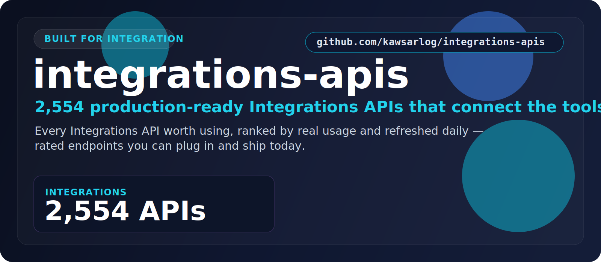

  

  <a href="#at-a-glance"><b>At a Glance</b></a> &nbsp;•&nbsp;
  <a href="#the-categories"><b>Categories</b></a> &nbsp;•&nbsp;
  <a href="#start-here"><b>Start Here</b></a> &nbsp;•&nbsp;
  <a href="#built-for"><b>Built For</b></a> &nbsp;•&nbsp;
  <a href="#why-this-repo"><b>Why This Repo</b></a>

## At a Glance

> **2,554** production-ready Integrations APIs.

A focused, always-fresh index of Integrations APIs that connect the tools your stack already runs on. Every entry is rated, shows real user counts, and is refreshed daily — so you find the right one fast.

| Metric | Value |
|--------|-------|
| **Total APIs** | **2,554** |
| **Categories** | 1 |
| **Last updated** | 2026-07-15 |
| **Update cadence** | Daily, automated |

## The Categories

<table>
  <tr>
    <td width="100%" valign="top">
      <h3>Integrations</h3>
      
<strong>2,554 APIs</strong>

      
Connectors and glue that wire your SaaS tools and systems together.

      
<a href="./Integrations/"><strong>Open Integrations &rarr;</strong></a>

    </td>
  </tr>
</table>

## Start Here

1. Pick the category that matches what you're building.
2. Open its folder and scan the API names, ratings, and user counts.
3. Click through to the provider page for docs, pricing, and setup.
4. Shortlist in minutes — no digging through unrelated categories.

## Explore the Stack

<strong>Integrations — 2,554 APIs</strong>

Connectors and glue that wire your SaaS tools and systems together.

[Browse Integrations APIs &rarr;](./Integrations/)

## Built For

<table>
  <tr>
    <td width="25%" align="center"><strong>iPaaS platforms</strong></td>
    <td width="25%" align="center"><strong>Connectors</strong></td>
    <td width="25%" align="center"><strong>SaaS glue</strong></td>
    <td width="25%" align="center"><strong>Webhooks</strong></td>
  </tr>
  <tr>
    <td width="25%" align="center"><strong>Data sync</strong></td>
    <td width="25%" align="center"><strong>Middleware</strong></td>
    <td width="25%" align="center"><strong>Internal tools</strong></td>
    <td width="25%" align="center"><strong>Automation</strong></td>
  </tr>
</table>

## Why This Repo

- **Opinionated, not exhaustive.** Only the categories that matter here — no clutter.
- **Always fresh.** A scheduled job re-scrapes the source and updates the counts daily.
- **Fast to scan.** Ratings and real usage numbers surface the APIs worth your time.
- **Consistent.** Every category follows the same clean, sortable layout.

## Star History

---

**2,554 APIs** across **1 categories** — updated 2026-07-15
 If this saved you time, a star helps others find it.

